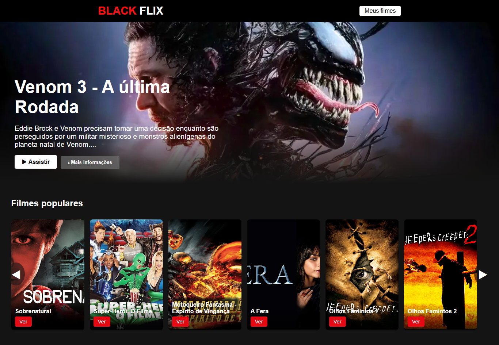
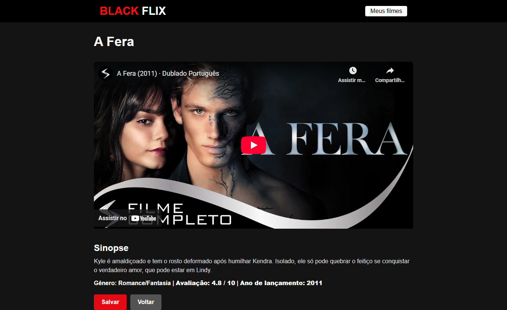

# 🎬 BlackFlix

<p align="center"> 
   
   
   
   
</p>

## 📌 Sobre o projeto

O **BlackFlix** é uma aplicação web inspirada na Netflix, que consome uma **API própria de filmes desenvolvida em Java com Spring Boot**.  
O sistema exibe um **banner em destaque** com o primeiro filme da API, além de uma seção de **filmes populares em carrossel com autoplay em loop**.

Cada filme contém título, sinopse, imagem e a **URL do YouTube** para assistir ao trailer ou filme.

Esse projeto foi desenvolvido com foco em **aprendizado de React, integração com API REST e estilização responsiva**.

---

## 🚀 Funcionalidades

- 🎥 Exibição de um filme em destaque com título, sinopse e link para assistir no YouTube
- 🎞️ Seção de filmes populares em carrossel com autoplay e navegação lateral infinita (loop)
- ▶️ Botões de ação: **Assistir** (abre vídeo do YouTube) e **Mais informações**
- 🌐 Consumo de API própria feita em **Java + Spring Boot**
- 🐘 Banco de dados **PostgreSQL**
- 📱 Layout responsivo com CSS puro
- 📝 Código organizado no padrão **Conventional Commits**

---

## 🖼 Preview do Projeto

### 🎥 Layout


### 🎞️ Filmes


---

## 🛠 Tecnologias Utilizadas

### Frontend
- ⚛️ React.js (useState, useEffect, React Router)
- 🎨 CSS (responsividade e estilização customizada)

### Backend
- ☕ **Java + Spring Boot** (API REST de filmes)
- 🗄️ Spring Data JPA (persistência de dados)
- 🐘 **PostgreSQL** (banco de dados principal)
- ▶️ Campo **url** para assistir trailers no **YouTube**
- ✍️ Campo extra **sinopse** incluído

---

## ⚙️ Como rodar o projeto

### 🔹 Clonar repositório
```bash
  git clone https://github.com/seu-usuario/blackflix.git
cd blackflix
🔹 Rodar API (Java + Spring Boot)
bash
Copiar código
cd backend
./mvnw spring-boot:run
---
```

### 🔹 Configurar Banco de Dados (PostgreSQL)
- Crie um banco chamado blackflix no PostgreSQL:
```bash
   CREATE DATABASE blackflix;
```
- No arquivo application.properties do backend, configure:
```bash
    spring.datasource.url=jdbc:postgresql://localhost:5432/blackflix
    spring.datasource.username=seu_usuario
    spring.datasource.password=sua_senha
    spring.jpa.hibernate.ddl-auto=update
    spring.jpa.show-sql=true
```
### 🔹 Rodar API (Java + Spring Boot)
```bash
  cd backend
./mvnw spring-boot:run

A API ficará disponível em: http://localhost:8080/movies

- Exemplo de resposta da API:

{
  "id": 1,
  "title": "Vingadores: Ultimato",
  "sinopse": "Após o estalar de dedos de Thanos, os Vingadores buscam uma forma de reverter a situação.",
  "image": "https://link-da-imagem.jpg",
  "url": "https://www.youtube.com/watch?v=TcMBFSGVi1c"
}
```

### 🔹 Rodar Frontend (React)
```bash
  cd frontend
npm install
npm start

O frontend ficará disponível em: http://localhost:3000
```

### 🔹👨‍💻 Autor

Feito com ❤️ por Paulo Vilela – Engenheiro de Software